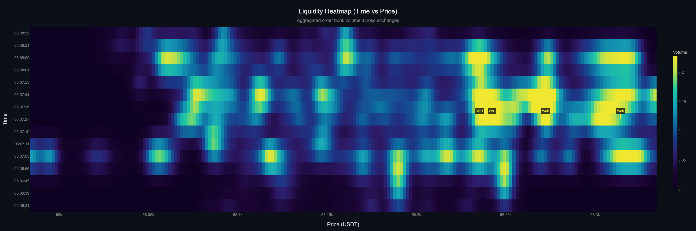

# Cross-Exchange Crypto Liquidity & Order Flow Engine

> Comparing order book depth, spread, and flow imbalance across major crypto exchanges



## Overview

Collects time-series order book data from Binance, Coinbase, and Kraken, then builds a multi-panel interactive dashboard showing how liquidity evolves over time — with heatmaps, 3D surfaces, wall detection, and imbalance trends.

## Features

- Time-series order book collection (30 samples at configurable intervals)
- Cross-exchange volume aggregation across 200 price bins
- Time vs Price liquidity heatmap with persistent wall detection
- 3D liquidity surface showing volume evolution
- Per-exchange order flow imbalance tracking over time
- Single-snapshot mode for quick analysis

## Metrics

| Metric | Description |
|--------|-------------|
| Best Bid / Ask | Top-of-book prices |
| Spread | Ask minus bid (absolute and bps) |
| Bid / Ask Volume | Total volume across top N levels |
| Imbalance | (bid_vol - ask_vol) / total_vol |

## Installation

```bash
git clone https://github.com/f20250217-blip/crypto-liquidity-engine.git
cd crypto-liquidity-engine
python -m venv venv
source venv/bin/activate
pip install -r requirements.txt
```

## Usage

```bash
python main.py
```

Set `MODE = "timeseries"` (default) for time-aware analysis or `MODE = "snapshot"` for single-frame.

Configure collection in `main.py`: `N_SAMPLES` (default 30), `INTERVAL_SEC` (default 10).

## Output

### Console

Formatted table with per-exchange metrics (best bid/ask, spread, volumes, imbalance).

### Time-Series Dashboard (default)

`output/dashboard.html` — unified 3-panel dashboard:

1. **Liquidity Heatmap** — time vs price, colored by volume intensity, with auto-detected wall annotations
2. **3D Liquidity Surface** — interactive surface showing volume evolution across price and time
3. **Imbalance Trends** — per-exchange order flow imbalance over the collection window

### Snapshot Mode

Single-frame outputs: `output/dashboard.html`, `output/heatmap.html`, `output/liquidity_comparison.png`

## Project Structure

```
crypto-liquidity-engine/
├── src/
│   ├── data_fetcher.py          # Multi-exchange order book retrieval
│   ├── orderbook_processor.py   # Bid/ask extraction
│   ├── metrics.py               # Liquidity and imbalance computation
│   ├── time_collector.py        # Time-series snapshot collector
│   ├── time_visualizer.py       # Time-aware dashboard builder
│   ├── visualizer.py            # Static matplotlib charts
│   └── advanced_visualizer.py   # Snapshot-mode Plotly dashboards
├── output/                      # Generated outputs
├── main.py                      # Pipeline entry point
├── requirements.txt
└── README.md
```

## License

MIT
