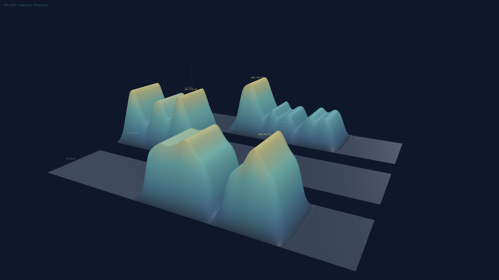

# Cross-Exchange Crypto Liquidity & Order Flow Engine

Real-time order book depth analysis across Binance, Coinbase, and Kraken with interactive 3D visualization and automated liquidity wall detection.

## 3D Liquidity Surface



Interactive version: open `output/3d_liquidity_pro.html` locally after running the pipeline.

## What It Shows

The 3D surface maps **order book liquidity** across three dimensions:

| Axis | Dimension | Description |
|------|-----------|-------------|
| **X** | Price (USDT) | BTC/USDT price range with numeric tick labels |
| **Z** | Exchange | Binance, Coinbase, Kraken — each as a separate surface strip |
| **Y** | Volume | Aggregated order book depth at each price level (relative %) |

## How to Read the Visualization

**Liquidity ridges** — Continuous elevated bands at price zones with concentrated resting orders. The pipeline detects contiguous high-volume regions, merges nearby peaks into ridges, and keeps only the top 2 dominant structures per exchange. Yellow-tipped peaks mark the strongest walls with vertical drop lines.

**Cross-exchange comparison** — Separated strips let you compare ridge structure across exchanges. Matching ridges signal consensus support/resistance.

**Heatmap** — Dark base through blue and cyan (high) to soft yellow (extreme concentration).

## Features

- Time-series order book collection (configurable sample count and interval)
- Ridge-based structure extraction (not raw peak detection)
- Automatic dead-edge cropping to active price region
- Contiguous liquidity band detection via scipy.ndimage.label
- Top 2 ridges per exchange with nearby-region merging
- Top 3 peak labels with vertical drop lines
- Hover tooltips: exchange, price, volume, wall detection
- Multi-panel dashboard with imbalance sparklines

## Metrics

| Metric | Description |
|--------|-------------|
| Best Bid / Ask | Top-of-book prices |
| Spread | Ask minus bid (absolute and basis points) |
| Bid / Ask Volume | Total volume across top N levels |
| Imbalance | (bid_vol - ask_vol) / total_vol |

## Installation

```bash
git clone https://github.com/f20250217-blip/crypto-liquidity-engine.git
cd crypto-liquidity-engine
python -m venv venv
source venv/bin/activate
pip install -r requirements.txt
```

## Usage

```bash
python main.py
```

Configure in `main.py`: `N_SAMPLES` (default 30), `INTERVAL_SEC` (default 10), `LIMIT` (default 50).

## Output

| File | Description |
|------|-------------|
| `output/3d_liquidity_pro.html` | Interactive 3D liquidity surface with grid surfaces, axes, walls, tooltips |
| `output/dashboard.html` | Multi-panel dashboard: 3D view + metrics table + imbalance sparklines |

## Project Structure

```
crypto-liquidity-engine/
├── src/
│   ├── data_fetcher.py          # Multi-exchange order book retrieval (ccxt)
│   ├── orderbook_processor.py   # Bid/ask DataFrame extraction
│   ├── metrics.py               # Spread, volume, imbalance computation
│   ├── time_collector.py        # Time-series snapshot collector
│   └── threejs_visualizer.py    # 3D engine + dashboard generator
├── output/                      # Generated visualizations
├── main.py                      # Pipeline entry point
├── requirements.txt
└── README.md
```

## License

MIT
