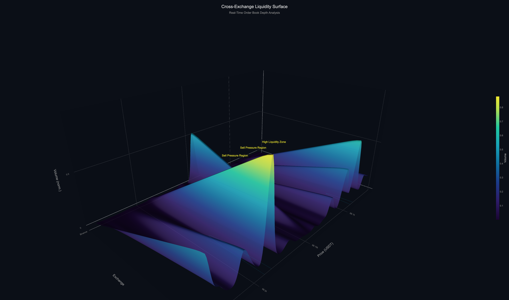

# Cross-Exchange Crypto Liquidity & Order Flow Engine

> Comparing order book depth, spread, and flow imbalance across major crypto exchanges



## Overview

Fetches live BTC/USDT order books from Binance, Coinbase, and Kraken, computes liquidity metrics, and generates interactive dashboards with depth heatmaps, a 3D liquidity surface, and imbalance charts.

## Features

- Real-time order book fetching from 3 exchanges via ccxt
- Bid/ask volume aggregation across top 50 levels
- Spread calculation in absolute and basis-point terms
- Order flow imbalance detection
- Interactive Plotly dashboards with dark theme
- Order book depth heatmap per exchange
- 3D cross-exchange liquidity surface
- Static matplotlib comparison charts

## Metrics

| Metric | Description |
|--------|-------------|
| Best Bid / Ask | Top-of-book prices |
| Spread | Ask minus bid (absolute and bps) |
| Bid / Ask Volume | Total volume across top N levels |
| Imbalance | (bid_vol - ask_vol) / total_vol |

## Installation

```bash
git clone https://github.com/f20250217-blip/crypto-liquidity-engine.git
cd crypto-liquidity-engine
python -m venv venv
source venv/bin/activate
pip install -r requirements.txt
```

## Usage

```bash
python main.py
```

## Output

### Console

Formatted table with per-exchange metrics (best bid/ask, spread, volumes, imbalance).

### Interactive Dashboards

| File | Description |
|------|-------------|
| `output/dashboard.html` | Imbalance and spread comparison bars |
| `output/heatmap.html` | Order book depth heatmap per exchange |
| `output/3d_liquidity.html` | 3D liquidity surface across exchanges and price levels |

### Static Plot

`output/liquidity_comparison.png` — matplotlib imbalance and spread charts.

## Project Structure

```
crypto-liquidity-engine/
├── src/
│   ├── data_fetcher.py          # Multi-exchange order book retrieval
│   ├── orderbook_processor.py   # Bid/ask extraction
│   ├── metrics.py               # Liquidity and imbalance computation
│   ├── visualizer.py            # Static matplotlib charts
│   └── advanced_visualizer.py   # Interactive Plotly dashboards
├── output/                      # Generated outputs
├── main.py                      # Pipeline entry point
├── requirements.txt
└── README.md
```

## License

MIT
